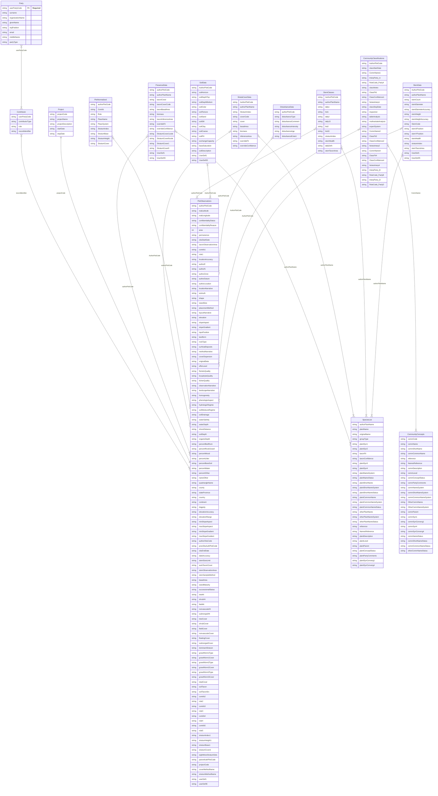

```mermaid
erDiagram

    Party}|--|{ Contributor : userPartyCode
    Party{
        string userPartyCode PK "**Required**"
        string surname
        string organizationName
        string givenName
        string orgPosition
        string email
        string middleName
        string partyType
    }

    Contributor}|--|{ PlotObservations : recordIdentifier
    Contributor{
        string userPartyCode
        string contributorType
        string role
        string recordIdentifier
    }

    Project||--|| PlotObservations : projectCode
    Project{
        string projectCode
        string projectName
        string projectDescription
        string startDate
        string stopDate
    }

    PresenceData }|--|{ PlotObservations : authorPlotCode
    PresenceData }|--|{ SpeciesList : authorPlantName
    PresenceData{
        string authorPlotCode
        string authorPlantName
        string taxonCover
        string taxonCoverCode
        string taxonBasalArea
        string biomass
        string taxonInferenceArea
        string overrideFit
        string overrideConfidence
        string StratumCover1code
        string StratumCover9code
        string StratumCover1
        string StratumCover9
        string UserDef1
        string UserDef25
    }

    StrataCoverData }|--|{ PlotObservations : AuthorPlotCode
    StrataCoverData }|--|{ SpeciesList : authorPlantName
    StrataCoverData{
        string AuthorPlotCode
        string authorPlantName
        string StratumIndex
        string coverCode
        string cover
        string basalArea
        string biomass
        string inferenceArea
        string overrideFit
        string overrideConfidence
    }

    PlotNormalized }|--|{ PlotObservations : authorPlotCode
    PlotNormalized{ 
        string authorPlotCode
        string Contrib
        string Role
        string PlaceName
        string PlaceSystem
        string StratumIndex
        string StratumBase
        string StratumHeight
        string StratumCover
    }

    StemClasses
    StemClasses }|--|{ PlotObservations : authorPlotCode
    StemClasses }|--|{ SpeciesList : authorPlantName
    StemClasses{
        string AuthorPlotCode
        string authorPlantName
        string tally1
        string list1
        string tally2
        string tally15
        string list2
        string list15
        string stratumIndex
        string stemHealth
        string tallyDefn
        string stemTaxonArea
    }

    SoilData
    SoilData }|--|{ PlotObservations : AuthorPlotCode
    SoilData{
        string AuthorPlotCode
        string soilHorizon
        string soilDepthTop
        string soilDepthBottom
        string soilColor
        string soilTexture
        string soilSand
        string soilSilt
        string soilClay
        string soilCoarse
        string soilPH
        string exchangeCapacity
        string baseSaturation
        string soilDescription
        string UserDef1
        string UserDef35
    }

    DisturbanceData
    DisturbanceData }|--|{ PlotObservations : authorPlotCode
    DisturbanceData{
        string authorPlotCode
        string disturbanceType
        string disturbanceComment
        string disturbanceIntensity
        string disturbanceAge
        string disturbanceExtent
    }

    CommunityClassifications
    CommunityClassifications }|--|{ PlotObservations : AuthorPlotCode
    CommunityClassifications }|--|{ CommunityConcepts : CommName
    CommunityClassifications{
        string AuthorPlotCode
        string classStartDate
        string CommName1
        string InterpParty_A
        string RoleCode_PartyA
        string classNotes
        string ClassFit1
        string ClassConfidence1
        string NotesInterp1
        string classStopDate
        string inspection
        string tableAnalysis
        string multivariateAnalysis
        string expertSystem
        string CommName2
        string ClassFit2
        string ClassConfidence2
        string NotesInterp2
        string CommName4
        string ClassFit4
        string ClassConfidence4
        string NotesInterp4
        string InterpParty_B
        string RoleCode_PartyB
        string InterpParty_D
        string RoleCode_PartyD
    }

    StemData
    StemData }|--|{ PlotObservations : AuthorPlotCode
    StemData }|--|{ SpeciesList : authorPlantName
    StemData{
        string AuthorPlotCode
        string authorPlantName
        string stemCount
        string stemDiameter
        string stemDiameterAccuracy
        string stemHeight
        string stemHeightAccuracy
        string StemCode
        string stemXPosition
        string stemYPosition
        string stemHealth
        string stratumIndex
        string stemTaxonArea
        string UserDef1
        string UserDef25
    }

    CommunityConcepts
    CommunityConcepts{
        string commCode
        string commName
        string commShortName
        string commCommonName
        string reference
        string NamesReference
        string commDescription
        string commLevel
        string commConceptStatus
        string commPartyComments
        string commNameSystem
        string commShortNameSystem
        string commCommonNameSystem
        string OtherCommName
        string OtherCommNameSystem
        string commParent
        string commSyn1
        string commSynConverg1
        string commSyn4
        string commSynConverg4
        string commNameStatus
        string commShortNameStatus
        string commCommonNameStatus
        string otherCommNameStatus
    }

    SpeciesList
    SpeciesList{
        string authorPlantName
        string plantName
        string originalName
        string groupType
        string plantSyn1
        string plantSyn2
        string taxonFit
        string taxonConfidence
        string plantSyn3
        string plantSyn4
        string plantNameSystem
        string plantNameStatus
        string plantShortName
        string plantShortNameSystem
        string plantShortNameStatus
        string plantCommonName
        string plantCommonNameSystem
        string plantCommonNameStatus
        string otherPlantName
        string otherPlantNameSystem
        string otherPlantNameStatus
        string reference
        string NamesReference
        string plantDescription
        string plantLevel
        string plantParent
        string plantConceptStatus
        string plantPartyComments
        string plantSynConverg1
        string plantSynConverg4
    }

    PlotObservations
    PlotObservations{
        string authorPlotCode
        string realLatitude
        string realLongitude
        string confidentialityStatus
        string confidentialityReason
        int area
        string permanence
        string obsStartDate 
        string taxonObservationArea
        string contrib1
        string role1
        string locationAccuracy
        string authorE
        string authorN
        string authorZone
        string authorDatum
        string authorLocation
        string locationNarrative
        string azimuth
        string shape
        string standSize
        string placementMethod
        string layoutNarrative
        string elevation
        string slopeAspect
        string slopeGradient
        string topoPosition
        string landform
        string rockType
        string surficialDeposits
        string methodNarrative
        string coverDispersion
        string originalData
        string efforLevel
        string floristicQuality
        string bryophyteQuality
        string lichenQuality
        string observationNarrative
        string landscapeNarrative
        string homogeneity
        string phenologicAspect
        string hydrologicRegime
        string soilMoistureRegime
        string soilDrainage
        string waterSalinity
        string waterDepth
        string shoreDistance
        string soilDepth
        string organicDepth
        string percentBedRock
        string percentRockGravel
        string percentWood
        string percentLitter
        string percentBareSoil
        string percentWater
        string percentOther
        string nameOther
        string quadrangleName
        string county
        string stateProvince
        string country
        string continent
        string dsgpoly
        string elevationAccuracy
        string elevationRange
        string minSlopeAspect
        string maxSlopeAspect
        string minSlopeGradient
        string maxSlopeGradient
        string authorObsCode
        string prevObsAuthPlotCode
        string obsEndDate
        string dateAccuracy
        string stemSizeLimit
        string autoTaxonCover
        string stemObservationArea
        string stemSampleMethod
        string basalArea
        string standMaturity
        string successionalStatus
        string treeHt
        string shrubHt
        string fieldHt
        string nonvascularHt
        string submergedHt
        string treeCover
        string shrubCover
        string fieldCover
        string nonvascularCover
        string floatingCover
        string submergedCover
        string dominantStratum
        string growthform1Type
        string growthform1Cover
        string growthform2Type
        string growthform2Cover
        string growthform3Type
        string growthform3Cover
        string totalCover
        string soilTaxon
        string soilTaxonSrc
        string contrib2
        string role2
        string contrib3
        string role3
        string contrib4
        string role4
        string contrib5
        string role5
        string stratumIndex1
        string stratumHeight1
        string stratumBase1
        string stratumCover1
        string eightMoreStratumSets
        string parentAuthPlotCode
        string projectCode
        string coverMethodName
        string stratumMethodName
        string userDef1
        string userDef35
    }
```